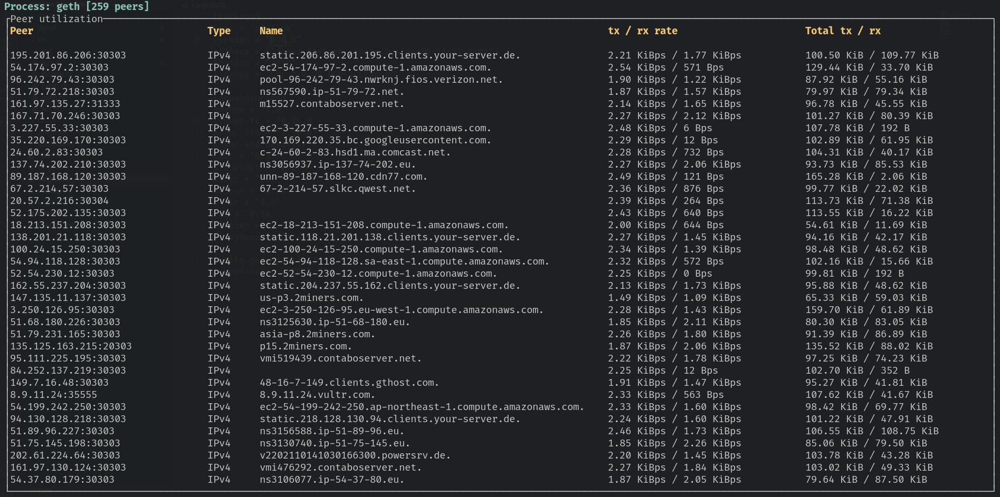

# p2pflow

> An eBPF application to monitor Ethereum p2p network traffic.



## Requirements

* Rust

Install [here](https://www.rust-lang.org/tools/install). Uses the `cargo-bpf` package to build and load the BPF
program into the kernel.
* Up-to-date Linux kernel

The project is built on technology like `CO-RE` and `BTF`, which is only
available in more recent kernels (5.0-ish). Ubuntu 20.10 has configured and packaged all the required dependencies.
* `vmlinux.h`

`vmlinux.h` contains all the kernel definitions on your current machine, which we need in the BPF programs.
You can generate it with `bpftool` (part of `linux-tools`):
```bash
bpftool btf dump file /sys/kernel/btf/vmlinux format c > src/bpf/vmlinux.h
```
Or run `make vmlinux`.

You can verify whether your kernel was built with BTF (BPF Type Format) enabled:

```bash
cat /boot/config-$(uname -r) | grep CONFIG_DEBUG_INFO_BTF
```
## Install & Build
`libbpf` is included as a submodule so that we don't have to rely on the system `libbpf`, which
can be out of date.
```
git clone --recurse-submodules -j8 https://github.com/netbound/p2pflow
cd p2pflow
cargo build --release
```

## Run
Running requires root privileges for loading the BPF program into the kernel and attaching it to the proper hooks.
```bash
sudo ./target/release/p2pflow --process geth
```
Or
```bash
make install
```
This will install the binary in `$HOME/.cargo/bin`, and adds the `cap_sys_admin` capability to let it run without sudo.